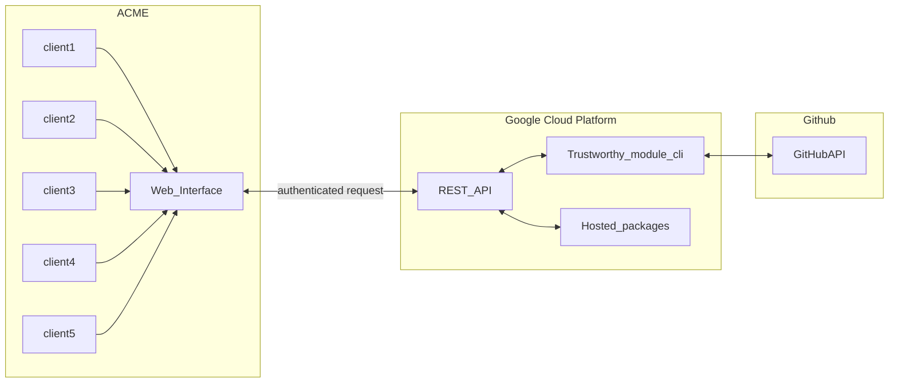

# Project Overview

## components
- Web Interface
- REST API
- Package metric CLI

```mermaid
graph LR
    subgraph ACME
    client1 --> Web_Interface
    client2 --> Web_Interface
    client3 --> Web_Interface
    client4 --> Web_Interface
    client5 --> Web_Interface
    end
    subgraph "Google Cloud Platform"
    REST_API <--> Trustworthy_module_cli 
    REST_API <--> Hosted_packages
    end
    subgraph "Github"
    GitHubAPI
    end
    Web_Interface -- authenticated request <--> REST_API
    Trustworthy_module_cli <--> GitHubAPI
```
